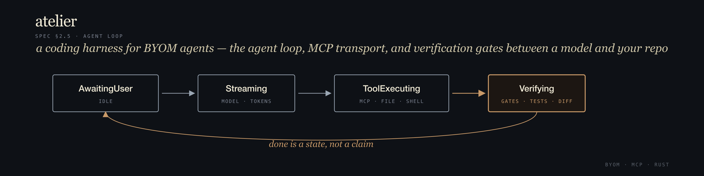
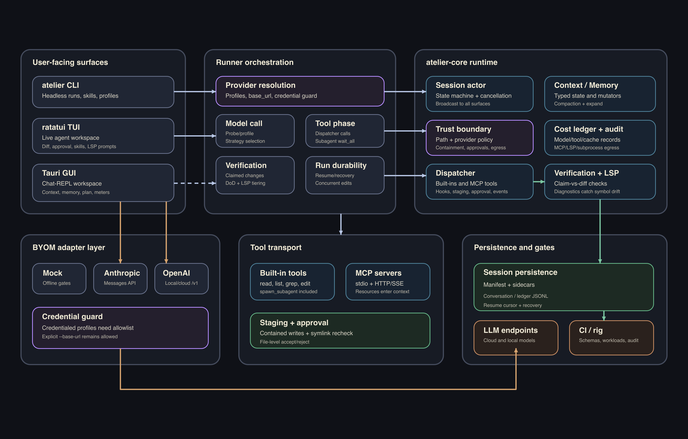

<p align="center">
  
</p>

<p align="center">
  <a href="#quick-start"><b>Quick start</b></a> |
  <a href="#choose-a-model"><b>Choose a model</b></a> |
  <a href="#open-the-gui"><b>GUI</b></a> |
  <a href="#use-the-cli"><b>CLI</b></a> |
  <a href="#troubleshooting"><b>Troubleshooting</b></a> |
  <a href="STATUS.md"><b>Status</b></a> |
  <a href="coding-harness-spec.md"><b>Spec</b></a>
</p>

# Atelier

[](https://github.com/ChrisAdkin8/atelier/actions/workflows/check.yml)
[](LICENSE)

Atelier is a **coding harness for AI software engineering** — a safe, observable workspace where any model (Anthropic, OpenAI-compatible, or the built-in Mock) can read code, propose edits, run tools, remember context, and prove that work is done.

## What Atelier gives you

| You want... | Atelier provides... |
|---|---|
| A desktop coding workspace | Tauri GUI with Chat/Agent modes, provider switching, Context, Memory, Sub-agent, and meters panels. |
| A terminal workflow | `atelier` CLI plus a `ratatui` TUI for live agent runs and file-level approval. |
| Bring-your-own-model support | Mock, Anthropic Messages API, and OpenAI-compatible chat-completions endpoints. |
| Safe API-key handling | OS keychain-backed provider credentials; plaintext provider keys in config are rejected. |
| Durable sessions | `.atelier/sessions/<uuid>/` stores resumable run state, conversation sidecars, ledgers, and recovery metadata. |
| Tooling with guardrails | Built-in tools and MCP tools go through the same dispatcher, hooks, sandbox, audit, and ledger path. |
| Better "done" semantics | The harness treats done as a verifiable state transition, not just a model claim. |

## Install

The v0.1.1 release supports Apple Silicon macOS and x86_64 Linux. Intel macOS is intentionally not shipped.

### CLI

Install with Homebrew:

```sh
brew install ChrisAdkin8/atelier/atelier
atelier --version
```

Or install with the release script:

```sh
curl -fsSL https://raw.githubusercontent.com/ChrisAdkin8/atelier/main/scripts/install.sh | sh
atelier --version
```

To install a specific release:

```sh
ATELIER_VERSION=v0.1.1 sh -c "$(curl -fsSL https://raw.githubusercontent.com/ChrisAdkin8/atelier/main/scripts/install.sh)"
```

The installer downloads the matching `atelier-cli-<target>.tar.gz` release asset, verifies its `.sha256` file when present, and places `atelier` in `~/.local/bin` unless `ATELIER_INSTALL_DIR` is set.

### GUI

GUI bundles are attached to the same GitHub Release as unsigned artifacts.

| Platform | Asset |
|---|---|
| Apple Silicon macOS | `Atelier_0.1.1_aarch64.dmg` |
| Linux (AppImage) | `Atelier_0.1.1_amd64.AppImage` |
| Debian / Ubuntu | `Atelier_0.1.1_amd64.deb` |

Download and install for your platform:

```sh
# macOS — drag Atelier into Applications, then clear quarantine on first launch:
xattr -dr com.apple.quarantine /Applications/Atelier.app && open /Applications/Atelier.app

# Linux AppImage:
chmod +x Atelier_0.1.1_amd64.AppImage && ./Atelier_0.1.1_amd64.AppImage

# Debian / Ubuntu:
sudo apt install ./Atelier_0.1.1_amd64.deb && atelier-gui
```

## Quick start

The first run uses the Mock provider, so it needs no API key, no network, and no model server.

### 1. Install the CLI

Use the release installer above, or install from a source checkout while developing Atelier:

```sh
cargo install --path crates/atelier-cli
```

### 2. Initialise your repo

From the repository you want Atelier to work in:

```sh
atelier init
```

This creates `.atelier/`, seeds `ATELIER.md` if needed, and prepares `.atelier/sessions/` for run history.

### 3. Run the offline smoke test

```sh
atelier run --provider mock "rename foo to bar"
```

The Mock provider exercises the real runner, dispatcher, staging, and persistence path without contacting a model.

### 4. Choose a real model

See [Choose a model](#choose-a-model) for Anthropic, Ollama, LM Studio, vLLM, and OpenAI setup.

## Open the GUI

The GUI is the friendliest way to use Atelier day to day.

```sh
cargo install tauri-cli --version "^2.0" --locked
npm --prefix crates/atelier-gui/ui install
cd crates/atelier-gui
cargo tauri dev
```

`cargo tauri dev` starts Vite at `http://127.0.0.1:1420/`, builds the Rust shell, and opens the desktop window.

In the GUI:

1. Click **Browse...** in the header and select the repo you want Atelier to work in.
2. Use **Chat** mode for normal conversation with the selected model.
3. Use **Agent** mode when you want tool-using runs that write durable sessions.
4. Watch the right-side panels for context, memory, plan, sub-agent progress, and token/cost meters.

## Use the CLI

Run a prompt from the terminal:

```sh
atelier run "<prompt>"
```

Common flags:

| Flag | Purpose |
|---|---|
| `--provider mock|anthropic|openai-compat` | Select the provider family. |
| `--profile <name>` | Use a named profile from `providers.toml`. |
| `--model <id>` | Model id sent to the provider. |
| `--base-url <url>` | OpenAI-compatible endpoint, usually ending in `/v1`. |
| `--workspace <path>` | Repo root; defaults to the current directory. |
| `--max-turns <n>` | Stop after N turns if the model has not claimed done. |
| `--prompt-file <path>` | Read the prompt from a file; use `-` for stdin. |
| `--no-probe` / `--force-probe` | Skip or force OpenAI-compatible capability probing. |

Use the TUI when you want a terminal workspace with live panes and file-level approval:

```sh
cargo run -p atelier-tui -- "<prompt>"
```

## Choose a model

### Mock provider

Use this for smoke tests and development. It never contacts a model.

```sh
atelier run --provider mock "try the loop"
```

### Anthropic

Set `ANTHROPIC_API_KEY`, then run:

```sh
atelier run \
  --provider anthropic \
  --model anthropic:claude-opus-4-7 \
  "<prompt>"
```

### OpenAI-compatible endpoints

Use `openai-compat` for Ollama, LM Studio, llama-server, vLLM, sglang, OpenAI, and LiteLLM-style gateways that expose chat-completions.

Example with Ollama:

```sh
brew install ollama
brew services start ollama
ollama pull qwen2.5-coder:7b

atelier run \
  --provider openai-compat \
  --base-url http://localhost:11434/v1 \
  --model local:qwen2.5-coder:7b \
  "<prompt>"
```

Other common base URLs:

| Server | Base URL |
|---|---|
| Ollama | `http://localhost:11434/v1` |
| LM Studio | `http://localhost:1234/v1` |
| llama-server | `http://localhost:8080/v1` |
| vLLM / sglang | `http://localhost:8000/v1` |
| OpenAI | omit `--base-url` or use `https://api.openai.com/v1` |

The first run against a new OpenAI-compatible `(model, base_url)` pair performs a short capability probe and caches the result in `~/.atelier/model_profiles/`.

You can score a configured profile before relying on it for Agent mode:

```sh
atelier providers score qwen2.5-72b-awq
atelier providers score qwen2.5-72b-awq --force-probe --json
```

The score is 0-100 and explains the model's fit for Atelier's harness: native tool calls, structured-output strategy, streaming, context window, UTF-8 cleanliness, max output budget, and prompt-cache support.

In the GUI, the active model badge shows the same fit score and opens an explanation popover when clicked. If an Agent-routed prompt would use a marginal or poor model, the Composer shows a warning before you send.

## Store provider API keys safely

For one-off shells and CI, environment variables are still supported:

```sh
export OPENAI_API_KEY=...
export ANTHROPIC_API_KEY=...
```

For day-to-day OpenAI-compatible profiles, prefer the OS keychain:

```sh
atelier providers auth qwen2.5-72b-awq \
  --from-command "terraform -chdir=../atelier-bedrock-infra/terraform output -raw openai_api_key"

atelier providers test qwen2.5-72b-awq
atelier run --profile qwen2.5-72b-awq "<prompt>"
```

This writes a secret-free reference such as:

```toml
api_key = "keyring:atelier/providers/qwen2.5-72b-awq"
```

Plaintext `api_key = "sk-..."` values are rejected at config load. `OPENAI_API_KEY` still overrides profile credentials for CI and one-off runs.

## Pin your defaults with `providers.toml`

Put repeated provider settings in `<repo>/.atelier/providers.toml` or `~/.atelier/providers.toml`.

```toml
default = "local"

[providers.local]
provider = "openai-compat"
base_url = "http://localhost:11434/v1"
model = "local:qwen2.5-coder:7b"

[providers.cloud]
provider = "anthropic"
model = "anthropic:claude-opus-4-7"

[runner]
max_turns = 32

[probe]
policy = "auto" # "auto" | "skip" | "force"
```

Resolution order is:

1. CLI flags for this invocation.
2. The selected provider profile.
3. Built-in defaults.

Project config wins over user config when both exist. If a config file exists but is malformed, Atelier fails loudly instead of silently falling back to defaults.

## Everyday workflows

### Memory

Atelier can remember useful facts across sessions:

- Project memory lives in `<workspace>/.atelier/memory/`.
- Personal memory lives in `~/.atelier/memory/`.
- Derived search indexes live outside the canonical card directories at `<workspace>/.atelier/indexes/memory.sqlite` and `~/.atelier/indexes/memory.sqlite`.
- The GUI Memory panel can add, delete, and promote memory cards.
- Chat and Agent runs auto-draft cards for known fixable provider/config problems such as auth failures, missing API-key environment variables, unreachable providers, rate limits, and context overflows. The Memory panel refreshes as soon as the card is written.


### Skills

Skills are slash-invoked prompt templates such as `/review`, `/fix`, `/test`, and `/document-sweep`.

```sh
atelier skills
atelier skills show review
atelier skills new my-skill --scope repo
atelier skills validate
```

The GUI Composer and TUI both support slash-skill completion.

### Sessions and resume

Each agent run writes to:

```text
.atelier/sessions/<uuid>/
```

That directory contains the schema-valid `session.json` manifest plus sidecars such as `conversation.jsonl`, `ledger.jsonl`, and `resume_index.json`. CLI resume and GUI Agent follow-up turns both resume from the durable session UUID.

### MCP tools

Atelier is MCP-first. Built-in tools and registered MCP tools share the same dispatcher, hooks, ledger, audit, and trust boundary. MCP server configuration uses the schemas under `schemas/config/`; see [`crates/atelier-core/README.md`](crates/atelier-core/README.md) and [`coding-harness-spec.md`](coding-harness-spec.md) for the deeper contract.

## Troubleshooting

| Problem | What to check |
|---|---|
| `atelier` is not found | Ensure `~/.cargo/bin` is on `PATH`, then rerun `cargo install --path crates/atelier-cli`. |
| Anthropic says API key missing | Set `ANTHROPIC_API_KEY` in the shell that runs Atelier. |
| OpenAI-compatible server returns 401 | Set `OPENAI_API_KEY` or run `atelier providers auth <profile>` and use `--profile <profile>`. |
| Local model is unreachable | Confirm the server is running and the `--base-url` ends in `/v1`. |
| GUI starts on a temp workspace | Click **Browse...** and select a real repo; the choice persists to `~/.atelier/gui.toml`. |
| A profile is ignored | Project `.atelier/providers.toml` wins over `~/.atelier/providers.toml`; check which file `atelier run` reports. |
| Config fails to load | Fix the TOML error. Atelier intentionally treats malformed config as fatal. |
| A GUI Agent follow-up starts fresh | The previous session directory was deleted; the GUI cleared the stale resume pointer and started fresh. The workspace choice persists in `~/.atelier/gui.toml`. |

## Architecture at a glance

<p align="center">
  
</p>

Atelier is a Rust workspace:

| Crate | Role |
|---|---|
| [`atelier-core`](crates/atelier-core/) | UI-free core: session actor, state machine, adapters, dispatcher, tools, MCP, persistence, context, memory, plan, ledger, verification. |
| [`atelier-cli`](crates/atelier-cli/) | `atelier` binary plus the reusable `Runner` library used by GUI/TUI driver modes. |
| [`atelier-gui`](crates/atelier-gui/) | Tauri 2.x + Svelte 5 desktop workspace. |
| [`atelier-tui`](crates/atelier-tui/) | `ratatui` terminal workspace. |

See [`coding-harness-spec.md`](coding-harness-spec.md) for the full design rationale.

## Project map

| Path | Purpose |
|---|---|
| [`coding-harness-spec.md`](coding-harness-spec.md) | Full harness specification. |
| [`STATUS.md`](STATUS.md) | Current implementation state and gate status. |
| [`CHANGELOG.md`](CHANGELOG.md) | Version-by-version project trail. |
| [`tasks/todo.md`](tasks/todo.md) | Active tracker and current work items. |
| [`docs/trust-boundary.md`](docs/trust-boundary.md) | Shared safety and trust-boundary contract. |
| [`schemas/`](schemas/) | JSON schemas for persisted/configured artifacts. |
| [`examples/`](examples/) | Example tools, hooks, skills, sub-agents, and config. |
| [`tests/`](tests/) | Calibration rig, canonical workloads, validators, and fixtures. |

For the exhaustive repository layout, see [`docs/layout.md`](docs/layout.md).

## Build and test

The toolchain is pinned via [`rust-toolchain.toml`](rust-toolchain.toml). If Cargo reports an `edition2024` error, see [`docs/toolchain.md`](docs/toolchain.md).

```sh
cargo build -p atelier-cli
cargo build -p atelier-core
cargo test -p atelier-core
```

Before opening a PR:

```sh
cargo fmt --check
cargo clippy --workspace --all-targets -- -D warnings
cargo test --workspace
make check
```

`make check` runs schema validation, artifact validation, rig self-tests, and canonical workload dry-runs. CI runs the same gates on push and PR.

## What is not here yet

- Bedrock and Vertex adapters are still future work.
- The GUI has no signed/notarized desktop installer yet.
- Provider API keys support OS keychain references today; generic MCP/hook `${keychain:...}` interpolation is still reserved and fails closed.
- The DoD config loader exists, but the full DoD command executor is still planned.

## Security

See [`SECURITY.md`](SECURITY.md) for supported versions and private vulnerability reporting. Do not open public issues for suspected vulnerabilities.

## Contributing

See [`CONTRIBUTING.md`](CONTRIBUTING.md) for the development loop, conventions, and PR process.

## License

Apache 2.0. See [`LICENSE`](LICENSE).
